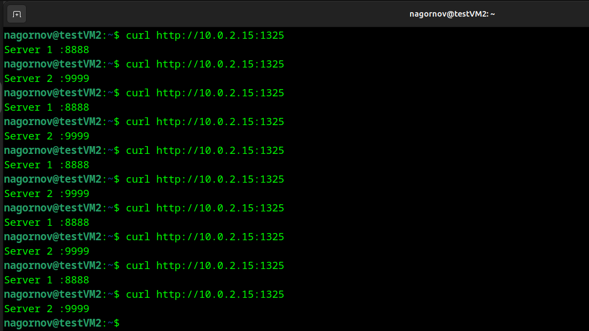
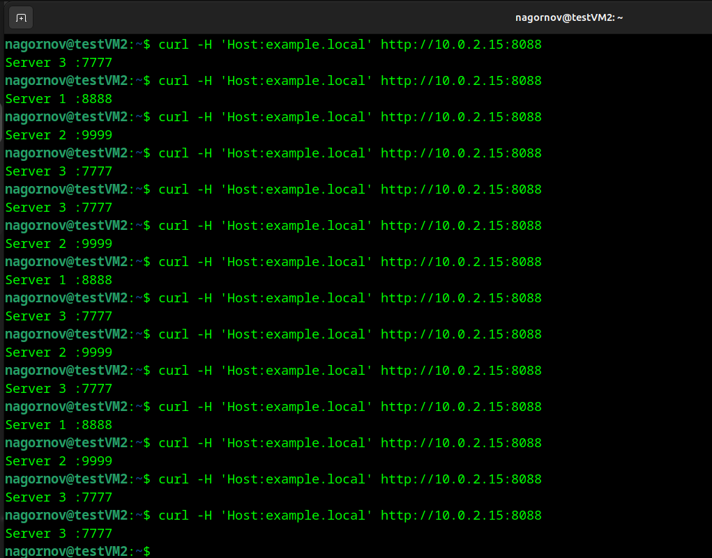

# Домашнее задание к занятию "Кластеризация и балансировка нагрузки" - `Нагорнов Антон Алексеевич`

### Задание 1

[config](https://github.com/Anton13Th/Clusterization-Balance/blob/main/files/haproxy1.conf)

### Задание 2

[Config](https://github.com/Anton13Th/Clusterization-Balance/blob/main/files/haproxy2.conf)
